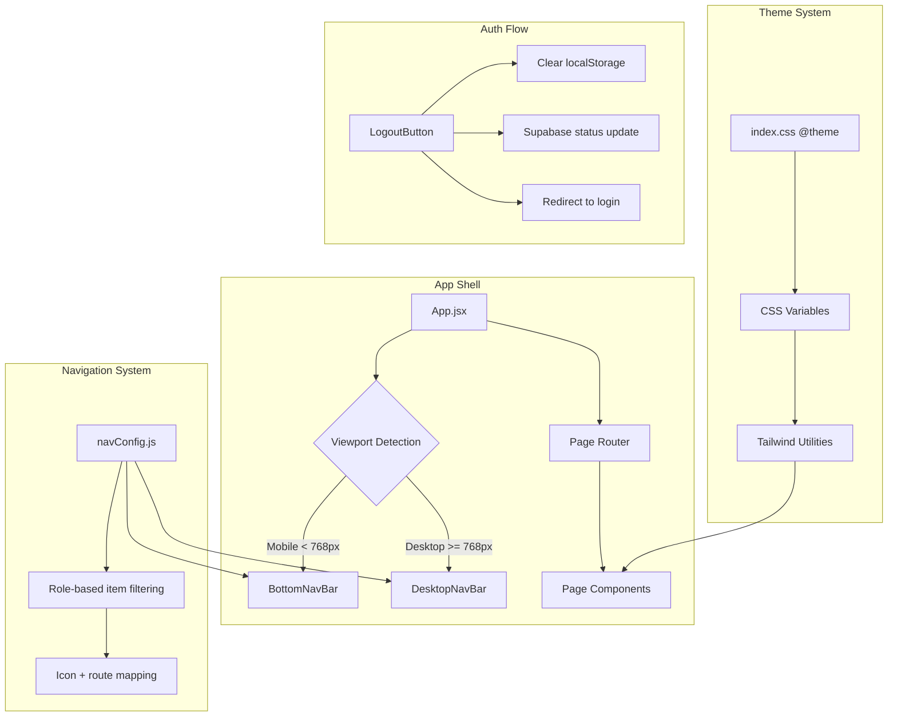

# Design Document: Dashboard Redesign

## Overview

This design describes the technical approach for redesigning the Chery Dashboard application to improve mobile responsiveness, navigation consistency, visual theming, and performance. The redesign introduces:

1. A **mobile-first bottom navigation bar** with icon-only buttons
2. A **persistently visible desktop navbar** (fixing the current auto-hide behavior)
3. A **standardized logout button** across all authenticated pages
4. A **black-and-white color theme** replacing colored gradients
5. **Removal of image upload** from the CRO Booking Panel

The application is a React 19 + Vite 7 SPA using Tailwind CSS v4, deployed on Vercel, with Supabase as the backend. The redesign targets the existing component architecture without introducing new routing libraries or state management tools.

### Design Decisions

- **No new dependencies**: The redesign uses existing Tailwind CSS utilities and React patterns already in the codebase.
- **Component extraction**: Navigation logic is extracted into dedicated `BottomNavBar` and `DesktopNavBar` components to centralize role-based routing.
- **Theme via CSS variables**: The black-and-white theme is implemented through Tailwind's `@theme` directive and CSS custom properties in `index.css`, avoiding per-component style overrides.
- **Progressive enhancement**: Mobile layout uses a single-column base with `md:` breakpoint modifiers for desktop multi-column layouts.

---

## Architecture



### Key Architectural Changes

1. **Current**: Navbar visibility is controlled by scroll/hover timers in `App.jsx` with inline logic.
2. **Proposed**: Extract navigation into `DesktopNavBar` and `BottomNavBar` components. Remove auto-hide logic. Use Tailwind responsive classes (`hidden md:flex` / `flex md:hidden`) for viewport switching.
3. **Current**: Each page component may have its own logout button styling.
4. **Proposed**: Single `LogoutButton` component rendered within the navigation bars, with consistent props.

---

## Components and Interfaces

### New Components

#### `BottomNavBar`

```typescript
interface BottomNavBarProps {
  user: { role: string; name: string } | null;
  currentPage: string;
  onNavigate: (page: string) => void;
  onLogout: () => void;
}
```

- Renders a fixed bar at the bottom of the screen on mobile viewports (`md:hidden`)
- Displays 3–6 icon-only navigation items based on `user.role`
- Highlights the active route icon
- Includes the `LogoutButton` as the last icon
- Hidden when `user` is null (login/public pages)

#### `DesktopNavBar`

```typescript
interface DesktopNavBarProps {
  user: { role: string; name: string } | null;
  currentPage: string;
  onNavigate: (page: string) => void;
  onLogout: () => void;
}
```

- Renders a fixed/sticky bar at the top on desktop viewports (`hidden md:flex`)
- Persistently visible (no auto-hide, no scroll-based hiding)
- Displays role-based navigation items with labels
- Includes the `LogoutButton`
- Hidden when `user` is null

#### `LogoutButton`

```typescript
interface LogoutButtonProps {
  onLogout: () => void;
  variant: 'navbar' | 'bottomnav';
}
```

- Consistent icon (`LogOut` from lucide-react), size, color, and shape
- `variant` controls only layout adaptation (icon-only in bottomnav, icon+label in navbar)
- Same visual treatment regardless of which page renders it

#### `navConfig.js` (Utility Module)

```typescript
interface NavItem {
  id: string;
  icon: React.ComponentType;
  label: string;
  page: string;
  ariaLabel: string;
}

function getNavItems(role: string): NavItem[];
function getDefaultPage(role: string): string;
```

- Pure function mapping roles to navigation items
- Returns 3–6 items per role
- Each item includes an `ariaLabel` for accessibility
- `getDefaultPage` returns the fallback page for a role when no dedicated route exists

### Modified Components

#### `App.jsx`

- Remove `isNavbarVisible`, `isAtTop`, `navbarTimerRef`, `resetNavbarTimer` logic
- Remove scroll-based navbar hiding
- Render `<DesktopNavBar>` and `<BottomNavBar>` conditionally based on auth state
- Add `pb-[72px] md:pb-0` to the main content wrapper for bottom nav clearance

#### `CroBookingPanel.jsx`

- Remove any image upload `<input type="file" accept="image/*">` elements
- Remove image preview/display logic
- Remove image-related state variables
- Retain Excel import (`accept=".xlsx, .xls"`) and all text fields
- Skip image reference fields when rendering booking records (graceful null handling)

#### All Page Components

- Replace colored gradient backgrounds with `bg-white` or `bg-zinc-50`
- Replace colored buttons with `bg-black text-white` or `border border-black text-black`
- Apply `hover:bg-zinc-200` or `hover:bg-black hover:text-white` transitions
- Ensure minimum tap target of `min-w-[44px] min-h-[44px]` on mobile
- Ensure text uses `text-black` with minimum `text-sm` (14px) on mobile

---

## Data Models

### Navigation Configuration

```javascript
// src/utils/navConfig.js
const NAV_CONFIG = {
  admin: [
    { id: 'admin', icon: LayoutDashboard, label: 'Dashboard', page: 'admin', ariaLabel: 'Admin Dashboard' },
    { id: 'booking', icon: Calendar, label: 'Booking', page: 'cro-booking', ariaLabel: 'Booking Management' },
    { id: 'display', icon: Monitor, label: 'Display', page: 'display', ariaLabel: 'Display Board' },
    { id: 'promo', icon: Tag, label: 'Promo', page: 'promo', ariaLabel: 'Promotions' },
  ],
  manager: [
    { id: 'manager', icon: LayoutDashboard, label: 'Dashboard', page: 'manager', ariaLabel: 'Manager Dashboard' },
    { id: 'display', icon: Monitor, label: 'Display', page: 'display', ariaLabel: 'Display Board' },
    { id: 'booking', icon: Calendar, label: 'Booking', page: 'booking-public', ariaLabel: 'Public Booking' },
  ],
  cro: [
    { id: 'cro', icon: FileText, label: 'CRO', page: 'cro', ariaLabel: 'CRO Panel' },
    { id: 'booking', icon: Calendar, label: 'Booking', page: 'cro-booking', ariaLabel: 'Booking Management' },
    { id: 'display', icon: Monitor, label: 'Display', page: 'display', ariaLabel: 'Display Board' },
  ],
  sparepart: [
    { id: 'sparepart', icon: Package, label: 'Sparepart', page: 'sparepart', ariaLabel: 'Sparepart Panel' },
    { id: 'quotation', icon: FileText, label: 'Quotation', page: 'quotation', ariaLabel: 'Quotation' },
    { id: 'stock', icon: BarChart, label: 'Stock', page: 'stock-comparison', ariaLabel: 'Stock Comparison' },
    { id: 'display', icon: Monitor, label: 'Display', page: 'display', ariaLabel: 'Display Board' },
  ],
  owner: [
    { id: 'owner', icon: LayoutDashboard, label: 'Dashboard', page: 'owner', ariaLabel: 'Owner Dashboard' },
    { id: 'stock', icon: BarChart, label: 'Stock', page: 'stock-comparison', ariaLabel: 'Stock Comparison' },
    { id: 'display', icon: Monitor, label: 'Display', page: 'display', ariaLabel: 'Display Board' },
  ],
  mekanik: [
    { id: 'mechanic', icon: Wrench, label: 'Workshop', page: 'mechanic', ariaLabel: 'Mechanic Panel' },
    { id: 'display', icon: Monitor, label: 'Display', page: 'display', ariaLabel: 'Display Board' },
    { id: 'booking', icon: Calendar, label: 'Booking', page: 'booking-public', ariaLabel: 'Public Booking' },
  ],
  customer: [
    { id: 'customer', icon: User, label: 'Profile', page: 'customer', ariaLabel: 'Customer Profile' },
    { id: 'booking', icon: Calendar, label: 'Booking', page: 'booking-public', ariaLabel: 'Book Service' },
    { id: 'tracking', icon: Truck, label: 'Tracking', page: 'tracking-public', ariaLabel: 'Track Delivery' },
  ],
};

const DEFAULT_PAGES = {
  admin: 'admin',
  manager: 'manager',
  cro: 'cro',
  sparepart: 'sparepart',
  owner: 'owner',
  mekanik: 'mechanic',
  customer: 'customer',
};
```

### Theme Configuration

```css
/* Updated index.css @theme */
@theme {
  --color-primary: #000000;
  --color-primary-hover: #27272a; /* zinc-800 */
  --color-bg: #ffffff;
  --color-bg-secondary: #fafafa; /* zinc-50 */
  --color-border: #e4e4e7; /* zinc-200 */
  --color-text: #000000;
  --color-text-muted: #a1a1aa; /* zinc-400 */
  --color-disabled-text: #d4d4d8; /* zinc-300 */
  --color-disabled-bg: #e4e4e7; /* zinc-200 */
}
```

### Booking Record (unchanged schema, rendering change only)

The Supabase `booking` table schema remains unchanged. Records that contain image reference fields (if any exist) are simply ignored during rendering — no migration needed.

---

## Correctness Properties

*A property is a characteristic or behavior that should hold true across all valid executions of a system — essentially, a formal statement about what the system should do. Properties serve as the bridge between human-readable specifications and machine-verifiable correctness guarantees.*

### Property 1: Role-based navigation returns valid item count and correct defaults

*For any* valid user role in the system (admin, manager, cro, sparepart, owner, mekanik, customer), the `getNavItems(role)` function SHALL return between 3 and 6 navigation items, and `getDefaultPage(role)` SHALL return a non-empty string matching one of the page identifiers in the navigation configuration.

**Validates: Requirements 2.2, 2.4, 3.2**

### Property 2: Logout clears all session state

*For any* authenticated user state (with any valid role, username, and session ID), invoking the logout handler SHALL result in: (a) localStorage keys `chery_auth_user` and `chery_session_id` being removed, (b) the current page being set to `'login'`, and (c) a Supabase update call being made to set `isOnline: false`.

**Validates: Requirements 4.4**

### Property 3: Status badge colors maintain muted saturation

*For any* status color token defined in the theme configuration (success, error, pending), the HSL saturation value SHALL be no greater than 50% of the corresponding default Tailwind color palette saturation value.

**Validates: Requirements 5.5**

### Property 4: Theme color pairs maintain accessible contrast

*For any* text-background color pair defined in the theme configuration (primary text on primary bg, muted text on secondary bg, disabled text on disabled bg), the WCAG contrast ratio SHALL be >= 4.5:1.

**Validates: Requirements 5.9**

### Property 5: Booking form submission excludes image data

*For any* booking form data object constructed by the CRO Booking Panel submit handler, the payload sent to Supabase SHALL NOT contain keys related to image data (no `image`, `imageUrl`, `imageFile`, `attachment`, or `photo` fields), and SHALL contain all required text fields (namaCustomer, noPlat, tipeMobil, keperluanService, tanggal, jam).

**Validates: Requirements 6.4**

### Property 6: Navigation items have accessible labels

*For any* navigation item returned by `getNavItems(role)` for any valid role, the item SHALL have a non-empty `ariaLabel` string property that describes the navigation destination.

**Validates: Requirements 7.5**

---

## Error Handling

### Logout Network Failure

- If the Supabase `update` call to set `isOnline: false` fails (network error, timeout), the logout handler SHALL still:
  1. Clear `localStorage` keys (`chery_auth_user`, `chery_session_id`)
  2. Set `currentPage` to `'login'`
  3. Display a toast notification: "Logout berhasil (sesi remote tidak dapat dihapus)"
- This ensures the user is never stuck in a logged-in state due to network issues.

### Legacy Image References in Booking Records

- When rendering a booking record, if a field key matches known image patterns (`image`, `imageUrl`, `foto`, `attachment`), the renderer SHALL skip it silently.
- No `console.error` or visible error state is produced.
- The record renders with all text fields intact.

### Invalid Role Handling

- If `getNavItems(role)` receives an unrecognized role string, it SHALL return an empty array and the navigation bars SHALL not render any items (effectively hiding navigation).
- The app SHALL redirect to the login page if no valid role is detected.

### Viewport Detection Edge Cases

- The responsive breakpoint is `768px` (Tailwind `md`).
- If the viewport is resized across the breakpoint while the app is open, both navigation components use CSS-only visibility (`hidden md:flex` / `flex md:hidden`), so no JavaScript re-render is needed.

---

## Testing Strategy

### Unit Tests (Example-Based)

Unit tests cover specific rendering scenarios and edge cases:

- **Layout tests**: Render each page component at 375px and 1280px viewports, verify no horizontal overflow, correct column count, and minimum tap target sizes.
- **Navigation rendering**: Render `BottomNavBar` and `DesktopNavBar` for each role, verify correct items displayed, active state highlighting, and hidden states on login/public pages.
- **Logout button consistency**: Render the logout button in both variants and verify identical icon/color/size.
- **CRO Booking Panel**: Verify no image upload elements exist, verify form submission payload structure, verify graceful handling of records with image reference fields.
- **Theme compliance**: Spot-check key components for black/white styling, absence of gradients, correct disabled states.

### Property-Based Tests

Property-based testing is applicable for the pure logic functions in this feature (navigation configuration, logout state management, theme color validation, form payload construction).

**Library**: [fast-check](https://github.com/dubzzz/fast-check) (JavaScript PBT library, compatible with Vitest)

**Configuration**:
- Minimum 100 iterations per property test
- Each test tagged with: `Feature: dashboard-redesign, Property {number}: {property_text}`

**Properties to implement**:
1. Role → nav items count (3–6) and default page validity
2. Logout handler clears all session state for any user
3. Status color saturation constraint
4. Theme contrast ratio >= 4.5:1
5. Booking form payload excludes image fields
6. All nav items have non-empty aria-labels

### Integration Tests

- **Navigation flow**: Simulate role-based login → verify correct page renders → tap bottom nav icons → verify page transitions.
- **Logout flow**: Login → trigger logout → verify redirect to login page and localStorage cleared.
- **Responsive behavior**: Resize viewport and verify correct navbar visibility toggling.

### Visual Regression Tests

- Snapshot tests for key pages at mobile (375px) and desktop (1280px) viewports to catch unintended layout changes during the theme migration.
